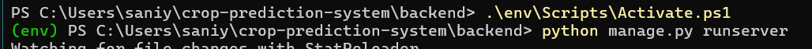

to run this file 
step 1- open two terminal window
open this file path
PS C:\Users\saniy\crop-prediction-system\backend> 
then active env by 
.\env\Scripts\Activate.ps1
then run 
python manage.py runserver
note :run in this 

then in 2nd terminal open 
PS C:\Users\saniy> cd crop-prediction-system
PS C:\Users\saniy\crop-prediction-system> cd frontend
PS C:\Users\saniy\crop-prediction-system\frontend> npm run dev

then  tab link  http://localhost:5173/  go to browser